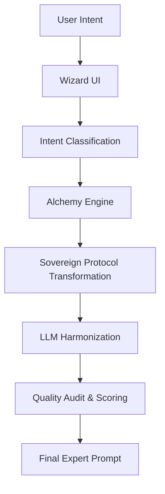
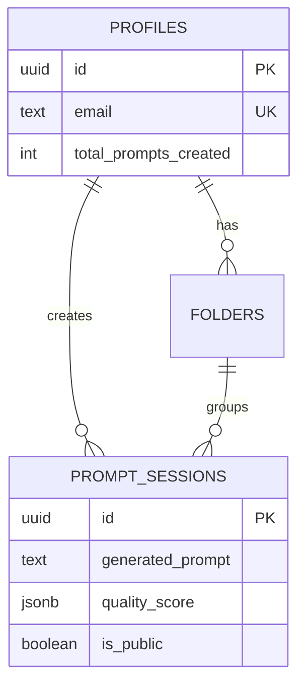

# Documentation for WhatToPrompt 🧪✨

Welcome to the comprehensive documentation for **WhatToPrompt** (Prompt Alchemist). This document consolidates all technical specifications, architectural frameworks, and operational guides into a single authoritative source.

---

## 🏛 Table of Contents
1. [System Architecture Overview](#system-architecture-overview)
2. [Sovereign Prompt Protocol (Theory)](#sovereign-prompt-protocol-theory)
3. [Backend: The Alchemy Engine](#backend-the-alchemy-engine)
4. [Frontend: The Interface of Alchemy](#frontend-the-interface-of-alchemy)
5. [Database: Diamond Production Schema](#database-diamond-production-schema)
6. [Deployment & Operations](#deployment--operations)

---

## 1. System Architecture Overview

WhatToPrompt is a production-grade prompt engineering platform designed to bridge the gap between novice intent and senior-level AI orchestration.

### Architectural Philosophy
The system is built on a decoupled architecture:
- **Frontend**: High-performance React (Vite) with a premium "Glassmorphism" UI.
- **Backend**: Asynchronous FastAPI service handling the "Alchemy Engine" logic.
- **Intelligence**: Multi-layered transformation using the **Sovereign Protocol**.

### System Flow

---

## 2. Sovereign Prompt Protocol (Theory)

The **Sovereign Prompt Protocol** is the theoretical foundation of WhatToPrompt, moving beyond simple refinement into **Structural Transformation**.

### The Transformation Delta
The protocol introduces a "Delta" between user intent and AI instruction:
- **Context Isolation**: Scrubs novice keywords and replaces them with "Architect Terms."
- **Credential Stacking**: Injects senior-level personas (e.g., "Senior Pedagogy Strategist") to unlock "expert" neurons.
- **Structural Axioms**: Automatically adjusts formatting for specific models (XML for Claude, Markdown for GPT).

### Optimization Frameworks
- **Chain-of-Thought (CoT)**: For technical/logical tasks ("Think step by step").
- **Tree-of-Thought (ToT)**: For strategic tasks (Multi-persona simulation).
- **AIDA**: Forced injection for marketing/sales conversion.

---

## 3. Backend: The Alchemy Engine

The backend is a stateful transformation pipeline built on **FastAPI**.

### Core Modules
- **`api/v1/`**: RESTful routes for chat and refinement.
- **`core/`**: Transformation, scoring, and vocabulary logic.
- **`services/`**: LLM gateway abstraction via OpenRouter.

### API Specifications
- **`POST /api/v1/chat`**: The primary generation endpoint.
- **`POST /api/v1/refine`**: Injects optimization frameworks into existing prompts.

### Model Harmonization
The engine maintains profiles for OpenAI, Anthropic, Google Gemini, and Meta Llama, ensuring every prompt is structured for the target model's architectural preferences.

---

## 4. Frontend: The Interface of Alchemy

A modern, fast, and responsive React application focused on speed and educational guidance.

### Technology Stack
- **Framework**: React 18 & Vite
- **Styling**: Tailwind CSS & shadcn/ui
- **Motion**: Framer Motion
- **Auth/DB**: Supabase

### Key Components
- **The Wizard**: A 6-step guided extraction flow with contextual intelligence.
- **Result Visualization**: Features "Prompt Anatomy" to educate users on the prompt's structure.
- **History Library**: Persistent storage of past generations.

---

## 5. Database: Diamond Production Schema 💎

Managed via **Supabase (PostgreSQL 15+)**, utilizing the **Diamond Production Schema (v2.1.0)**.

### ER-Diagram

### Automation & Triggers
- **`handle_new_user()`**: Auto-initializes profiles and default folders.
- **`update_profile_stats()`**: Real-time tracking of generation metrics.
- **RLS Security**: Strict Row-Level Security ensures users only see their own data.

---

## 6. Deployment & Operations

### Production Stack
- **Frontend**: Netlify (Statics build)
- **Backend**: Render/Heroku (uvicorn)
- **Database**: Supabase
- **Gateway**: OpenRouter

### Environment Keys
Required for operations:
- `VITE_SUPABASE_URL` / `VITE_SUPABASE_ANON_KEY`
- `VITE_API_URL`
- `OPENROUTER_API_KEY`

---
> [!NOTE]
> This project is designed for high-conversion and senior-level AI orchestration. Always ensure the backend is active to maintain the Alchemy transformation pipeline.
