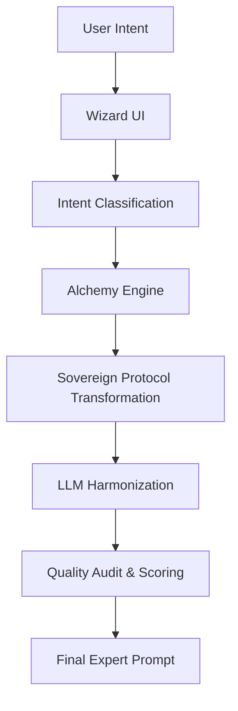

# WhatToPrompt (Prompt Alchemist) 🧪✨

[](#)
[](#)

**WhatToPrompt** is a production-grade prompt engineering platform designed to bridge the gap between novice intent and senior-level AI orchestration. By leveraging a multi-layered "Alchemy Engine," the system transforms vague user ideas into structured, high-fidelity prompts optimized for leading LLMs.

---

## 🏛 Architecture Overview

The system is built on a modern decoupled architecture:

- **Frontend**: A high-performance React application built with Vite, utilizing Tailwind CSS for a premium "Glassmorphism" UI and Framer Motion for interactive state transitions.
- **Backend**: An asynchronous FastAPI service that handles the core transformation logic, multi-model orchestration, and quality auditing.
- **Intelligence Layer**: The "Alchemy Engine," a proprietary set of logic gates that perform context isolation, credential stacking, and dynamic framework injection (CoT, ToT, etc.).

### System Flow


---

## 🚀 Key Features

### 1. Sovereign Prompt Transformation
Unlike simple rephrasers, WhatToPrompt uses **Context Isolation**. It strips away novice terminology and rebuilds the prompt using "Architect Terms"—senior-level professional analogs that force the LLM into high-performance modes.

### 2. Multi-Model Harmonization
The backend maintains research-backed profiles for OpenAI, Anthropic, Google Gemini, and Meta Llama. It automatically adjusts prompt structure (XML for Claude, Markdown for GPT) based on the target model's architectural preferences.

### 3. Progressive Intent Extraction (Wizard)
A chat-based interactive wizard that uses **Conversation Intelligence** to identify missing prompt components (Role, Task, Context, Constraints) and asks smart follow-up questions to reach "Prompt Maturity."

### 4. Interactive Quality Auditing
Every generated prompt is scored across three dimensions:
- **Completeness**: Presence of all structural axioms.
- **Technical Specificity**: Domain-specific terminology depth.
- **Clarity of Constraints**: Explicit definition of output limitations.

---

## 🛠 Technical Stack

### Backend
- **Framework**: [FastAPI](https://fastapi.tiangolo.com/) (Python 3.10+)
- **LLM Gateway**: OpenRouter (Unified API for GPT-4, Claude 3.5, etc.)
- **Validation**: Pydantic v2
- **Logic**: Custom "Alchemy Engine" with heuristic classification.

### Frontend
- **Library**: [React 18](https://reactjs.org/)
- **Build Tool**: [Vite](https://vitejs.dev/)
- **Styling**: Tailwind CSS & Lucide Icons
- **Deployment**: Optimized for Netlify/Vercel.

---

## 📖 Documentation Index

For deeper technical insights, please refer to the following:

- [**Backend Deep Dive**](docs/backend.md): API specs, Alchemy Engine logic, and Model Configurations.
- [**Frontend Architecture**](docs/frontend.md): Component structure, Theme system, and State management.
- [**Database Architecture**](docs/database.md): Schema design, RLS, triggers, and ER-Diagrams.
- [**Deployment Guide**](docs/deployment.md): Environment variables, Production builds, and Scaling.
- [**The Sovereign Protocol**](docs/philosophy.md): Theoretical background on our prompt transformation delta.

---

## 👨‍💻 Getting Started

### Prerequisites
- Node.js (v18+)
- Python (v3.10+)
- API Keys: OpenRouter (configured in `.env`)

### Local Development

1. **Clone and Setup**
   ```bash
   git clone https://github.com/your-repo/whattoprompt.git
   cd whattoprompt
   ```

2. **Backend Setup**
   ```bash
   cd backend
   python -m venv venv
   source venv/bin/activate # or venv\Scripts\activate
   pip install -r requirements.txt
   uvicorn main:app --reload
   ```

3. **Frontend Setup**
   ```bash
   cd frontend
   npm install
   npm run dev
   ```

---

## 📜 License
This project is licensed under the MIT License - see the LICENSE file for details.
