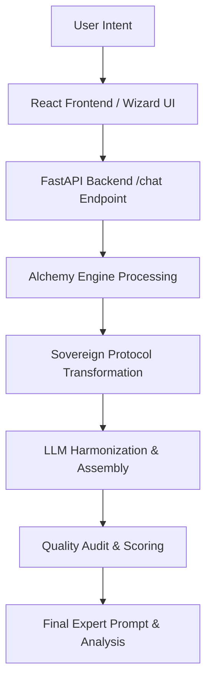

# WhatToPrompt: Comprehensive Technical & Architectural Documentation

Welcome to the complete technical and architectural documentation for **WhatToPrompt (Prompt Alchemist)**. This document provides a deep dive into the system's philosophy, backend mechanics, frontend interface, and database schemas. It dissects every major component, page, and logical flow within the application.

---

## 1. System Philosophy & Architecture Overview

WhatToPrompt is a production-grade prompt engineering platform designed to bridge the gap between novice intent and senior-level AI orchestration. The core of the system is the **Sovereign Prompt Protocol**, an architecture that transforms vague user inputs into structured, high-fidelity prompts optimized for leading Large Language Models (LLMs).

### The Sovereign Transformation Delta
1. **Context Isolation**: The system acts as a "Black Box", scrubbing novice keywords and extracting the core intent to build a new, professional payload from scratch.
2. **Credential Stacking**: The system injects senior-level personas (e.g., "Senior Pedagogy Strategist") to unlock the specific "expert" neurons of the target LLM.
3. **Structural Axioms**: The system automatically structures outputs based on the intended LLM's architecture (e.g., XML for Claude, Markdown for GPT, Instruction blocks for Llama).
4. **Optimization Frameworks**: For advanced tasks, the system utilizes Chain-of-Thought (CoT) or Tree-of-Thought (ToT) strategies to enforce logical sequencing and rigorous structural evaluation.

### High-level Flow

---

## 2. Backend Architecture: The Alchemy Engine

The backend is a stateful transformation pipeline driven by an asynchronous **FastAPI** service in Python. It interacts securely with LLMs via **OpenRouter**, maintaining fallback strategies and precise token estimations.

### 2.1 Core API Entry Points (`backend/api/v1/chat.py`)
- **`POST /api/v1/chat`**: The primary endpoint receiving user requests. It orchestrates the transformation logic. Depending on the request type, it processes explicit fields (role, task, context, constraints) via a "Wizard mode" or a generic chat message history. It responds with the fully crafted `expert_prompt`, an interpretive `explanation`, and a granular `quality_score`.
- **`POST /api/v1/refine`**: Used for progressive enhancement. It injects specific frameworks (like Chain-of-Thought) into an existing prompt, invoking a secondary audit cycle to display the updated score.

### 2.2 The Alchemy Engine (`backend/core/alchemy_engine.py`)
This file is the heartbeat of WhatToPrompt, exceeding 1,200 lines of robust orchestration logic:
- **`ModelConfig`**: Defines constants, axioms, model fallbacks (e.g., GPT-4o falling back to GPT-3.5), context window limitations, and cost mapping.
- **Sovereign Utilities** (`terminal_cleanse`, `detect_gibberish`): Data sanitization safeguards protecting token limits from spam inputs.
- **`get_sovereign_system_prompt`**: Dynamically constructs system instructions depending on the `task_category`.
- **`instant_vague_correction`**, **`analyze_conversation`**: Implements Conversational Intelligence, diagnosing what prompt components the user has omitted and synthesizing questions to surface them.
- **Quality Audit (`audit_generated_prompt`)**: Automatically critiques the generated output based on Separation of Concerns, Negative Constraints, and Variable Specificity to compute a final Letter Grade (A+, B-, etc.).

### 2.3 Prompt Enrichment & Templates (`backend/core/prompt_enricher.py` & `expert_templates.py`)
- **`PromptEnricher`**: Contains deep dictionaries of professional semantic replacements. For example, if a user demands a "writer", the Enricher upgrades it to a specific expert-level persona containing targeted credentials and output methodologies. It scales across Roles, Tasks, Contexts, and Constraints.
- **`ExpertTemplates`**: Over 50 carefully crafted base templates to bootstrap users based on their target industry and desired output.

### 2.4 Models & External Services
- **`chat_models.py`**: Pydantic models ensuring rigid Type-Safety across the network (e.g., `ChatRequest`, `ChatResponse`, `ResultMessage`).
- **`openrouter_client.py`**: The bridge to external LLMs. It packages messages and applies robust error handling to handle gateway timeouts or rate limits from providers.

---

## 3. Frontend Architecture: The Interface of Alchemy

The frontend is built on **React 18** and **Vite**, using **Tailwind CSS** and **shadcn/ui** to construct a sleek, premium "Glassmorphic" interface with dynamic **Framer Motion** state transitions.

### 3.1 Routing Structure (`App.tsx`)
The application defines an explicit set of routes wrapped around a `QueryClientProvider` for declarative data fetching:
- `/` (Index): Landing page
- `/wizard`: The intelligent setup sequence
- `/result`: The transformation outcome
- `/templates`: The library
- `/auth`, `/history`: Supabase-powered user sessions

### 3.2 The Wizard (`frontend/src/pages/Wizard.tsx`)
A highly complex, multi-step state machine that guides the user safely into high-fidelity prompt engineering.
- **State Management**: It maintains variables for `task`, `context`, `aiModel`, `tone`, `requirements`, and `role`. 
- **Dynamic Interaction**: It calculates completion percentage dynamically, preventing progression if data quality is insufficient (`isStepValid()`).
- **Educational UI**: Features a `PromptAnatomy` component to visualize the structural building blocks of an expert prompt as they are populated.

### 3.3 The Result Interface (`frontend/src/pages/Result.tsx`)
The destination payload visualization.
- Receives state from `react-router` containing the `expertPrompt`, `explanation`, and the `WizardInputs`.
- Displays the generated prompt in a highlighted, one-click-to-copy code block.
- **Refinement Actions**: Provides "Refine with CoT" handlers that trigger asynchronous calls back to `/api/v1/refine`, dynamically updating the UI upon completion.

### 3.4 Integration & Aesthetics
- **API Communication**: The app abstracts HTTP fetch chains inside custom hooks or direct `supabase.js` abstractions to persist historical generations directly to the `prompt_sessions` table.
- **Design Tokens**: Configuration inside `tailwind.config.ts` handles complex dark-mode palettes, glassmorphic blur layers, and consistent typography suitable for an enterprise-level SaaS product.

---

## 4. Database Architecture & Security (Supabase)

WhatToPrompt operates a "Hybrid Analytics" database designed for PostgreSQL 15+.
- **`profiles`**: Extends the `auth.users` system to hold AI token usage metrics and display preferences.
- **`folders` & `prompt_sessions`**: Normalizes the relationship between a user's generated prompts and their organizational containers. Contains fields like `quality_score` and `wizard_inputs` stored as structured `jsonb` payloads.
- **Security**: Rigorously protected via Row Level Security (RLS). A user can exclusively read or write records where `user_id = auth.uid()`.
- **Triggers**: PL/pgSQL functions like `handle_new_user()` instantly deploy default configurations upon registration.

---

## 5. Deployment Pipelines

- **Frontend (Netlify)**: Packaged into high-performance static assets (`npm run build`). API connectivity injected via `VITE_API_URL`. Handles SPAs natively via an underlying `_redirects` configuration.
- **Backend (Render / PaaS)**: Executed under a Uvicorn ASGI server (`uvicorn main:app`). Connects statefully to OpenRouter and operates fully asynchronously.

## Conclusion
WhatToPrompt functions as a tightly coupled, sophisticated machine for educational and productive prompt orchestration, marrying an intuitive, wizard-driven frontend to a complex, heuristic-driven "Alchemy" backend.
