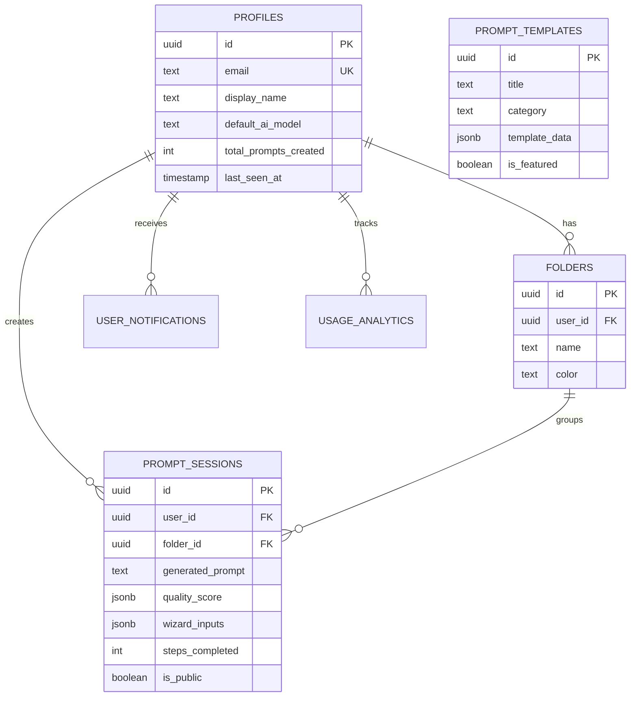

# Database Documentation: Diamond Production Schema 💎

WhatToPrompt uses a highly optimized PostgreSQL schema (v2.1.0) managed via Supabase. The architecture follows a "Hybrid Analytics" approach, balancing relational integrity with performance-focused indexing.

## 🗺 Entity Relationship Diagram (ERD)

---

## 📋 Core Tables

### 1. `profiles`
Extends `auth.users` with application-specific metadata and preferences.
- **Key Feature**: Stores model preferences and cascading onboarding states.
- **Security**: Bound to Supabase Auth UID.

### 2. `folders`
Allows users to organize their prompts into logical collections.
- **Cascading Logic**: Deleting a folder optionally soft-deletes contained sessions via triggers.

### 3. `prompt_sessions`
The primary operational table storing the output of the Alchemy Engine.
- **Wizard Context**: Stores the `wizard_inputs` as JSONB for high-fidelity reconstruction.
- **Scoring**: Stores quality metrics (`overall_score`, `dimensions`) for analytics.
- **Public Sharing**: Support for `public_url_slug` and `is_public` flags.

### 4. `usage_analytics` & `audit_logs`
High-volume log tables for tracking user engagement and security events.

---

## 🔐 Security Model (RLS)

Strict Row Level Security (RLS) is applied to all sensitive tables.

| Table | Policy Name | Logic |
| :--- | :--- | :--- |
| `profiles` | Users view own profile | `auth.uid() = id` |
| `folders` | Users manage own folders | `auth.uid() = user_id` |
| `prompt_sessions` | Users view own/public | `auth.uid() = user_id OR is_public = TRUE` |

---

## ⚡ Automation & Triggers

The schema includes several "Senior-Level" PL/pgSQL triggers:

1. **`handle_new_user()`**:
   - Automatically initializes a profile upon sign-up.
   - Creates a default "My Masterpieces" folder.
   - Queues a welcome notification.

2. **`update_profile_stats()`**:
   - Real-time incrementing of `total_prompts_created`.
   - Updates `last_prompt_created_at`.
   - Auto-completes onboarding flags on the first generation.

3. **`soft_delete_folder_contents()`**:
   - Propagates folder deletion status to all child sessions for data consistency.

---

## 🗃 Seeding & Templates

The system comes pre-loaded with optimized templates for:
- **DeepSeek Code Master**: Optimized for logic and debugging.
- **Gemini Creative Writer**: Leveraging long-form context.
- **Nous Hermes Analyst**: Strategic reasoning.
- **Professional Email**: Business communication.
