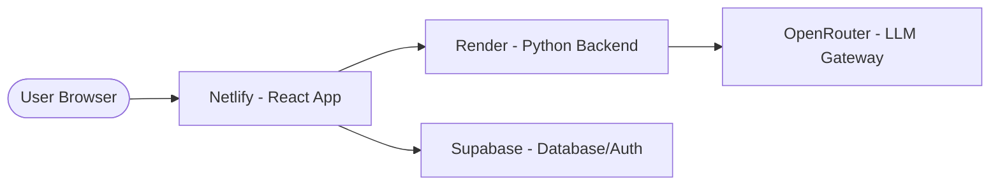

# Deployment & Operations Guide 🚀

WhatToPrompt is designed to be easily deployable on modern PaaS (Platform as a Service) providers like Netlify (Frontend) and Render/Heroku (Backend).

## 🌍 Production Architecture



---

## 🎨 Frontend Deployment (Netlify)

The frontend is built for static deployment.

### 1. Build Settings
- **Build Command**: `npm run build`
- **Publish Directory**: `dist`
- **Node Version**: 18+

### 2. Environment Variables
Ensure these are set in your Netlify dashboard:
- `VITE_SUPABASE_URL`: Your project URL.
- `VITE_SUPABASE_ANON_KEY`: Your project anonymous key.
- `VITE_API_URL`: The URL of your deployed backend service.

### 3. SPA Support
A `netlify.toml` is included to handle client-side routing redirects:
```toml
[[redirects]]
  from = "/*"
  to = "/index.html"
  status = 200
```

---

## 🐍 Backend Deployment (Render / Heroku)

The backend is a standard FastAPI containerized or process-based application.

### 1. Build Settings
- **Runtime**: Python 3.10+
- **Build Command**: `pip install -r requirements.txt`
- **Start Command**: `uvicorn main:app --host 0.0.0.0 --port $PORT`

### 2. Environment Variables
- `OPENROUTER_API_KEY`: Your unified gateway key.
- `PORT`: Automatically set by most PaaS providers.

---

## 💾 Database & Auth (Supabase)

The project uses the **Diamond Production Schema (v2.1.0)**. 

### 1. Schema Setup
For the full schema definition, triggers, and automated logic, please refer to the [**Database Architecture Documentation**](database.md).

To initialize the database:
1. Open your Supabase SQL Editor.
2. Copy and execute the contents of the `Diamond Schema` provided in the system design documents.
3. Verify that the `pg_cron` extension is enabled if you plan to use scheduled notifications.

### 2. Automated Triggers
The schema includes automated triggers that handle:
- **New User Onboarding**: Auto-creates profiles and default folders.
- **Stats Tracking**: Real-time counter for prompt generations.
- **Soft Deletes**: Consistency for folder/session relationships.

---

## 🛡 Security & Best Practices

- **CORS Configuration**: The `origins` list in `backend/main.py` must be updated to include your production frontend URL.
- **Context Isolation**: Our Sovereign Protocol ensures no sensitive user input "leaks" into the final AI context by scrubbed re-building.
- **Failover Logic**: The backend includes automated fallback to secondary models (e.g., GPT-3.5) if the primary model (GPT-4o) fails.
